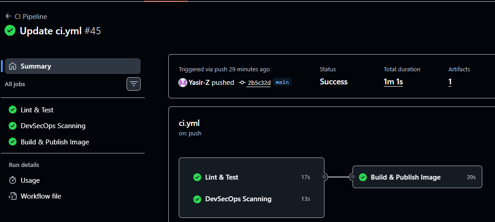
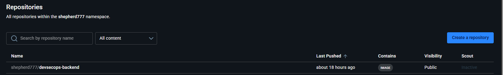
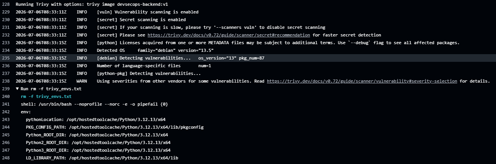
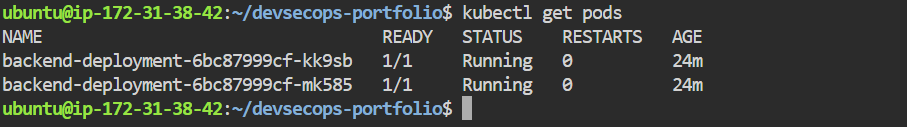

# DevSecOps Portfolio – Secure CI/CD Pipeline with Docker, GitHub Actions & Kubernetes

An end-to-end DevSecOps project demonstrating secure software delivery using automated testing, security scanning, containerization, and Kubernetes deployment.

## Project Highlights

* Automated CI pipeline using GitHub Actions

* Unit testing with Pytest

* Static Application Security Testing (SAST) using Bandit

* Dependency vulnerability scanning using pip-audit

* Secret detection using Gitleaks

* Docker image vulnerability scanning using Trivy

* Secure Docker image publishing to Docker Hub

* Kubernetes deployment with rolling updates

* Liveness and Readiness Probes

* ConfigMaps and Secrets for configuration management

* Ingress for external application access

* Fail-fast pipeline to stop insecure or broken builds

---

## Architecture

Architecture Diagram

                    Developer
                        │
                  git push
                        │
                        ▼
              GitHub Repository
                        │
                        ▼
              GitHub Actions CI
                        │
        ┌───────────────┼────────────────┐
        ▼               ▼                ▼
     Pytest          Bandit         pip-audit
        │               │                │
        └───────────────┼────────────────┘
                        ▼
                  Gitleaks Scan
                        │
                        ▼
                 Docker Build
                        │
                        ▼
                 Trivy Scan
                        │
              HIGH/CRITICAL?
                 │          │
               YES          NO
                │            ▼
           Pipeline Fails  Docker Hub
                              │
                              ▼
                     Kubernetes Cluster
                              │
                         Deployment
                              │
                     ┌────────┴────────┐
                     ▼                 ▼
                  Pod 1             Pod 2
                     ▲                 ▲
                     └──── Service ────┘
                              ▲
                           Ingress
                              ▲
                           Internet

The deployment flow follows this architecture:

Developer → GitHub → GitHub Actions → Security Gates → Docker Build → Trivy Image Scan → Docker Hub → Kubernetes Deployment → Service → Ingress → Users

---

## Business Problem

Manual deployments are slow, error-prone, and difficult to audit. Security checks are often performed late in the software delivery lifecycle, increasing the risk of deploying vulnerable applications.

This project demonstrates how DevSecOps practices can automate testing, security validation, containerization, and deployment while reducing deployment risk and improving software quality.

---

## Technology Stack

### Application

* Python 3.12
* Flask

### Version Control

* Git
* GitHub

### CI/CD

* GitHub Actions

### Security

* Pytest
* Bandit
* pip-audit
* Gitleaks
* Trivy

### Containerization

* Docker
* Docker Hub

### Container Orchestration

* Kubernetes

---

# CI/CD Pipeline

The GitHub Actions workflow performs the following stages automatically whenever code is pushed to the `main` branch.

### 1. Checkout Repository

Downloads the latest source code onto the GitHub Actions runner.

### 2. Setup Python

Installs Python 3.12.

### 3. Install Dependencies

Installs all project dependencies from `requirements.txt`.

### 4. Run Unit Tests

Executes Pytest to ensure the application functions correctly before continuing.

### 5. Static Application Security Testing (SAST)

Bandit scans the Python source code for common security issues.

### 6. Dependency Vulnerability Scan

pip-audit checks installed Python packages for known CVEs.

### 7. Secret Detection

Gitleaks scans the repository to prevent accidental exposure of credentials or secrets.

### 8. Docker Image Build

Builds a Docker image only after all previous quality and security gates have passed.

### 9. Container Image Scan

Trivy scans the Docker image for HIGH and CRITICAL vulnerabilities.

### 10. Publish Docker Image

The validated image is tagged with the Git commit SHA and pushed to Docker Hub.

---

# Security Gates

This project implements multiple automated security gates.

| Tool      | Purpose                             |
| --------- | ----------------------------------- |
| Pytest    | Application testing                 |
| Bandit    | Static code security analysis       |
| pip-audit | Dependency vulnerability scanning   |
| Gitleaks  | Secret detection                    |
| Trivy     | Docker image vulnerability scanning |

The pipeline follows the **fail-fast principle**, preventing insecure or broken code from progressing to later deployment stages.

---

# Kubernetes Deployment

The application is deployed using Kubernetes with the following resources:

* Deployment
* Service
* ConfigMap
* Secret
* Ingress

Production-oriented practices demonstrated include:

* Multiple replicas
* Rolling updates
* Rollback strategy
* Liveness Probe
* Readiness Probe
* Resource requests and limits
* External configuration using ConfigMaps
* Sensitive configuration using Secrets

---

# Project Screenshots

## GitHub Actions



---

## Docker Hub



---

## Trivy Scan



---

## Kubernetes



---

# Project Structure

```text
devsecops-portfolio/
│
├── backend/
├── frontend/
├── k8s/
├── .github/workflows/
├── images/
├── README.md
└── .gitignore
```

---

# Running the Project

Clone the repository:

```bash
git clone https://github.com/Yasir-Z/production-ready-devsecops-pipeline.git
```

Build the Docker image:

```bash
docker build -t devsecops-backend:v1 backend/
```

Run the container:

```bash
docker run -p 5000:5000 devsecops-backend:v1
```

Deploy to Kubernetes:

```bash
kubectl apply -f k8s/
```

---

## Skills Demonstrated

* DevSecOps

* CI/CD Pipeline Design

* Docker Containerization

* Kubernetes Deployment

* GitHub Actions Automation

* Secure Software Delivery

* Infrastructure Automation

* Application Security

* Vulnerability Management

* Container Security

---

# Future Improvements

* Terraform for infrastructure provisioning
* Ansible for configuration management
* Prometheus monitoring
* Grafana dashboards
* Kubernetes Horizontal Pod Autoscaler
* Production-ready cloud deployment

---

### Author: Yasir Zafar

This project was built to demonstrate practical DevSecOps skills by integrating automated testing, security scanning, containerization, and Kubernetes deployment into a production-inspired CI/CD workflow.
